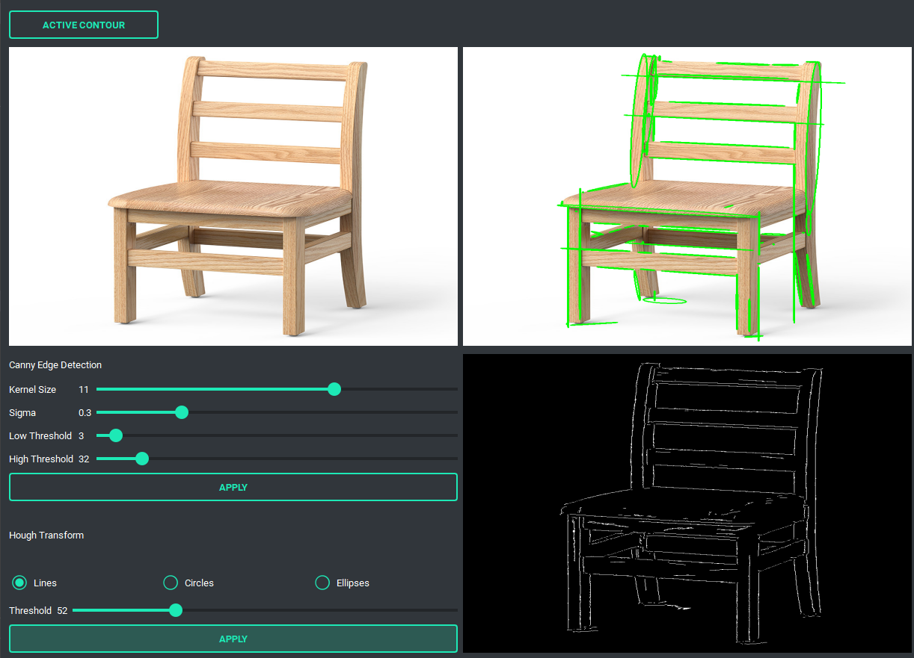
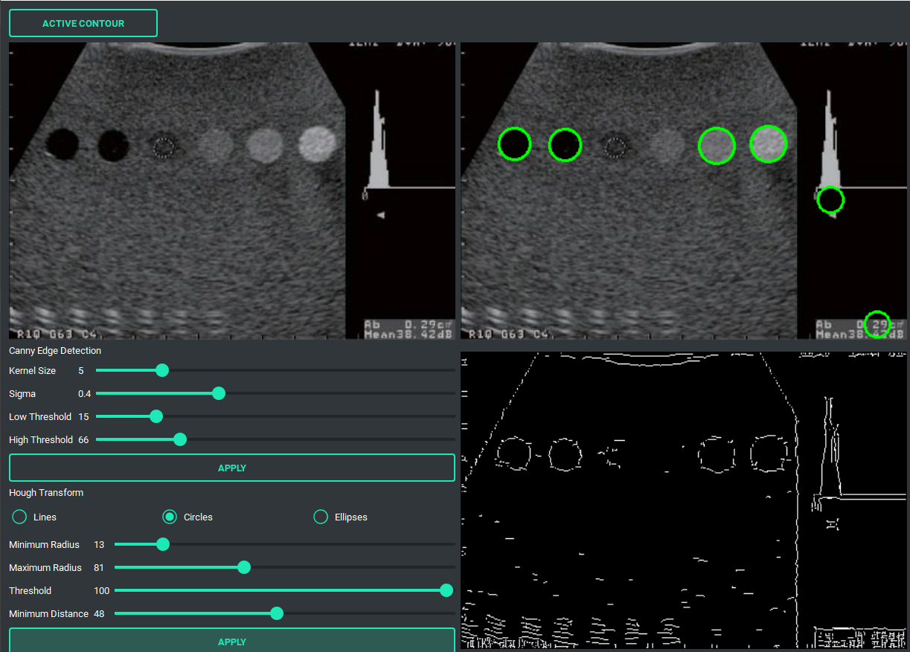
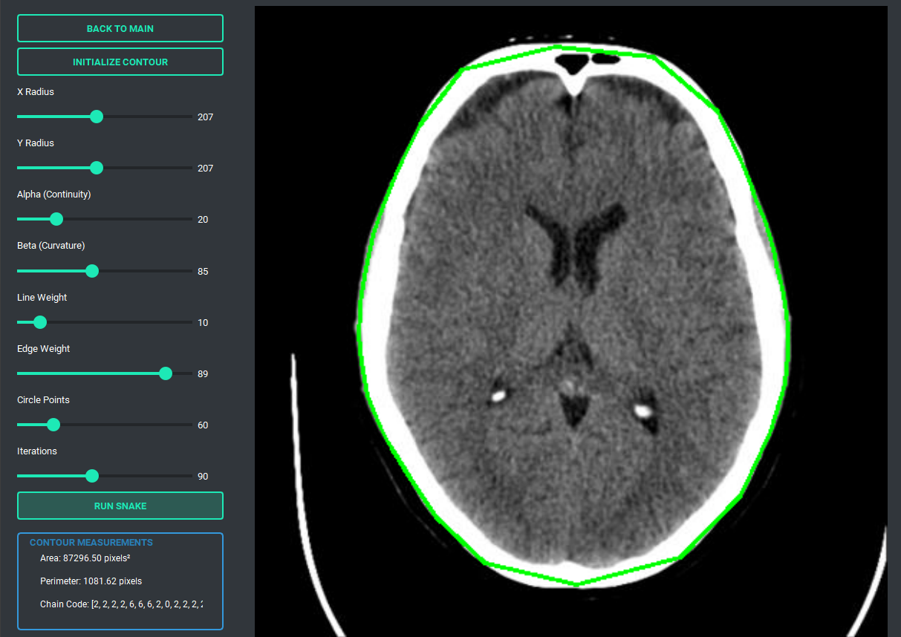

# Computer Vision Toolkit from Scratch

A comprehensive computer vision project implementing classical image processing and shape detection algorithms **from scratch**, without relying on high-level OpenCV detection functions. This project demonstrates the mathematical foundations behind edge detection, Hough-based shape detection, and active contour models (Snakes).

---

## 📌 Features

### 🔍 Edge Detection

Implemented from scratch:

* Canny Edge Detector

Features:

* Gradient magnitude and direction computation
* Non-maximum suppression
* Double thresholding
* Edge tracking by hysteresis

---

### 📏 Line Detection

Implemented using the **Hough Transform**:

* Accumulator space construction
* Peak detection
* Line parameter extraction
* Overlay visualization on original images

---

### ⭕ Circle Detection

Implemented using the **Circular Hough Transform**:

* Radius range selection
* Voting-based circle detection
* Multiple circle support
* Circle overlay visualization

---

### 🥚 Ellipse Detection

Implemented from scratch:

* Ellipse parameter selection
* Ellipse visualization

---

### 🐍 Active Contour Model (Snake)

Implemented energy-minimizing active contours:

* Internal energy

  * Elasticity term
  * Smoothness term

* External energy

  * Edge attraction forces

Features:

* Interactive contour initialization
* Iterative contour evolution
* Boundary extraction and segmentation

---

## 🖥️ User Interface


### Line Detection Module



---

### Circle Detection Module



---


### Active Contour Module



---

---

## ⚙️ Installation

Clone the repository:

```bash
git clone https://github.com/Ahmed-Hajhamed/Edge-and-Shape-Detection-Factory.git
cd Edge-and-Shape-Detection-Factory
```

Create a virtual environment:

```bash
python -m venv .venv
```

Activate the environment:

### Windows

```bash
.venv\Scripts\activate
```

### Linux / macOS

```bash
source .venv/bin/activate
```

Install dependencies:

```bash
pip install -r requirements.txt
```

---

## 🚀 Usage

Run the application:

```bash
python main.py
```

Workflow:

1. Load an image.
2. Choose the desired algorithm.
3. Adjust parameters.
4. Run detection.
5. Visualize and compare results.

---

## 🛠️ Technologies Used

* Python
* NumPy
* OpenCV (image I/O and visualization only)
* PyQt5
* Matplotlib

---

## 👨‍💻 Contributers

<table>
  <tr>
    <td align="center">
      <a href="https://github.com/Ahmed-Hajhamed">
        <br>
        <b>Ahmed Hajhamed</b>
      </a>
    </td>
    <td align="center">
      <a href="https://github.com/AhmedEtma">
        <br>
        <b>Ahmed Etman</b>
      </a>
    </td>
    <td align="center">
      <a href="https://github.com/zeyad-wail">
        <br>
        <b>Zeyad Wail</b>
      </a>
    </td>
    <td align="center">
      <a href="https://github.com/MohamadAhmedAli">
        <br>
        <b>Mohamed Ahmed</b>
      </a>
    </td>
  </tr>
</table>
